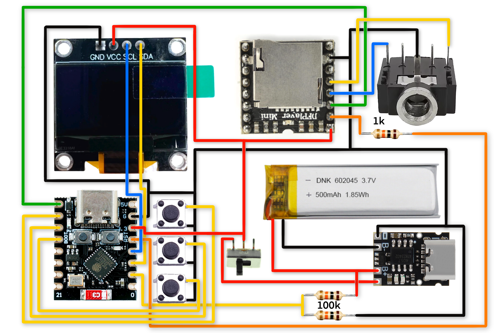

# DIYPOD Shuffle

A compact open-source MP3 player built around the ESP32-C3 SuperMini and DFPlayer Mini, with a 128x64 SSD1306 OLED display, three-button interface, LiPo battery, three built-in games, and a hidden WS2812B LED visualizer easter egg.

[](https://www.youtube.com/watch?v=0DcIXDLIxA4)

*Watch the build and demo video on [YouTube @Cortex-Technology](https://www.youtube.com/@Cortekz-Technology)*

---

## Photos


---

## Features

- Plays MP3 files from a FAT32 microSD card
- 128x64 SSD1306 OLED UI with animated header, scrolling text, and bitmap icons
- Browse tracks, control volume, and switch EQ presets from the menu
- Shuffle and repeat modes
- Auto-play and configurable sleep timeout
- Button lock to prevent accidental input
- Battery meter with low-battery auto-pause
- Settings saved to flash via Preferences
- Three built-in games — Snake, Brick Breaker, Ping Pong

---

## Hardware

### Bill of Materials

| Component | Value / Part | Notes |
|---|---|---|
| Microcontroller | ESP32-C3 SuperMini | |
| MP3 module | DFPlayer Mini | |
| Display | SSD1306 OLED 128x64 I2C | 0x3C address |
| Charger | TP4057 LiPo module | |
| Battery | Single cell LiPo (1S), any capacity | 500mAh recommended |
| Buttons | 6x6mm tactile, qty 3 | |
| Resistor | 1kΩ | On DF RX line |
| Resistors | 100kΩ, qty 2 | Voltage divider for battery meter |
| Power switch | SPDT slide switch | On main VCC rail |
| Audio jack | 3.5mm stereo TRS | Any standard through-hole jack works |
| microSD card | FAT32 formatted | Up to 32GB |
| Protoboard | Any standard size | |

### Wiring



| Signal | ESP32-C3 GPIO |
|---|---|
| OLED SDA | GPIO2 |
| OLED SCL | GPIO3 |
| DFPlayer RX | GPIO4 (via 1kΩ resistor) |
| DFPlayer TX | GPIO5 |
| Button TOP | GPIO6 + GND |
| Button BOT | GPIO7 + GND |
| Button MID | GPIO8 + GND |
| Battery divider | GPIO1 (100kΩ+100kΩ) |
| LED strip data | GPIO21 (optional) |
| Audio input | GPIO0 (optional) |

### Audio Jack Wiring

Any standard 3.5mm stereo TRS jack works. Wire as follows:

- DFPlayer DAC_L → Tip
- DFPlayer DAC_R → Ring
- GND → Sleeve

### Battery Meter

The voltage divider uses two 100kΩ resistors from BAT+ to GND with the midpoint connected to GPIO1. This allows the firmware to read battery percentage and display it in the header. If the voltage divider is omitted the battery icon shows an X and low-battery auto-pause is disabled.

---

## SD Card Setup

1. Format the card as FAT32
2. Name files numerically — `0001.mp3`, `0002.mp3`, `0003.mp3` etc.
3. Copy files to the root directory — no subfolders
4. Use DriveSort (Windows) to ensure correct FAT table order, or format fresh and copy files in order
5. Always eject safely before removing the card

The DFPlayer reads files in FAT table order, not filename order. Renaming files without reformatting will not reorder them.

---

## Flashing

### Required Libraries

Install via Arduino Library Manager:

- Adafruit SSD1306
- Adafruit GFX
- DFRobotDFPlayerMini
- Adafruit NeoPixel

### Board Setup

1. Install the ESP32 board package via Arduino Boards Manager
2. Select **ESP32C3 Dev Module**
3. Set USB CDC On Boot to **Enabled**

### Upload

1. Clone or download this repository
2. Open `DIYPOD.ino` in Arduino IDE
3. Connect the ESP32-C3 via USB
4. Select the correct COM port
5. Click Upload

---

## Button Reference

| Screen | TOP | MID | BOT |
|---|---|---|---|
| Now Playing | Next track | Play/Pause | Prev track |
| Now Playing (hold) | Skip forward | Open menu | Skip back |
| Menu | Scroll up | Select | Scroll down |
| Browse Tracks | Scroll up | Play track | Scroll down |
| Volume | Vol+ | Back | Vol- |
| Equalizer | Next EQ | Confirm | Prev EQ |
| Settings | Scroll up | Toggle | Scroll down |

**Global combos:**
- TOP + BOT hold (500ms) — toggle button lock
- TOP + MID + BOT hold (1s) — reset DFPlayer and rescan SD card

**Sleep wake:** hold any button for 700ms.

**Skip acceleration on Now Playing hold:**
- 0–5s: skip by 1
- 5–10s: skip by 10
- 10s+: skip by 100

---

## Games

DIYPOD Shuffle includes three built-in games accessible from the Games menu. Each game has a difficulty selection screen before starting.

### Brick Breaker

Break all the bricks by bouncing the ball off the paddle. Don't let the ball fall past the paddle.

| Button | Action |
|---|---|
| TOP | Move paddle right |
| BOT | Move paddle left |
| MID | Pause |
| MID hold | Exit to menu |

**Features:**
- Multi-hit bricks — outline only (1 hit), half filled (2 hits), fully filled (3 hits)
- Ball angle varies based on where it hits the paddle
- Combo multiplier — consecutive bricks without a paddle touch multiply your score
- Extra life power-ups — catch the falling heart with the paddle
- 3 lives per game

**Scoring:** `10 × level × combo × difficulty multiplier`

| Difficulty | Multiplier | Paddle | Ball speed |
|---|---|---|---|
| Easy | 1x | Wide | Slow |
| Normal | 2x | Medium | Medium |
| Hard | 3x | Narrow | Fast |

---

### Ping Pong

Play against an AI opponent. First to 10 points wins.

| Button | Action |
|---|---|
| TOP | Move paddle up |
| BOT | Move paddle down |
| MID | Pause |
| MID hold | Exit to menu |

**Features:**
- Ball angle varies based on where it hits the paddle
- Ball speed increases with each rally
- Win streak tracked and saved to flash

| Difficulty | AI behavior |
|---|---|
| Easy | Slow, occasionally misses |
| Normal | Moderate reaction time |
| Hard | Near-instant reaction |

---

### Snake

Guide the snake to eat food and grow as long as possible without hitting the walls or yourself.

| Button | Action |
|---|---|
| TOP | Turn right |
| BOT | Turn left |
| MID | Pause |
| MID hold | Exit to menu |

| Difficulty | Points per food |
|---|---|
| Easy | +1 |
| Normal | +10 |
| Hard | +100 |

---

## Battery Meter

A 100kΩ+100kΩ voltage divider from BAT+ to GPIO1 allows the firmware to read battery voltage and display a charge indicator in the header. The last cell flashes when critically low.

If no voltage divider is connected the battery icon displays an X and low-battery auto-pause is disabled. Low battery auto-pause triggers at 0% to prevent SD card corruption from sudden power loss.

---

## LED Visualizer Easter Egg

A hidden WS2812B VU meter that runs passively whenever music is playing.

### Additional Parts

| Component | Notes |
|---|---|
| WS2812B LED strip | Any length, set NUM_LEDS in config.h |
| 5V power supply | Power strip separately, share GND with board |
| 300-470Ω resistor | Optional, on data line |

### Wiring

1. Connect **DAC_L** from DFPlayer → **GPIO0**
2. Connect **LED strip data** → **GPIO21**
3. Power strip from separate 5V supply, connect GND to board GND

### Tuning

Adjust in `config.h`:

```cpp
#define NUM_LEDS        144   // Length of your strip
#define VIS_SMOOTHING   0.7f  // Higher = smoother, slower response
#define VIS_PEAK_DECAY  0.99f // Higher = slower peak dot decay
#define VIS_SENSITIVITY 300   // Lower = more sensitive to quiet audio
```

---

## Developer Notes

To simulate battery level without hardware, set in `config.h`:

```cpp
#define VBAT_SIMULATE  true
#define VBAT_SIM_PCT   75
```

---

## File Structure

```
DIYPOD/
├── DIYPOD.ino        — setup() and loop()
├── config.h          — pins, constants, enums
├── state.h           — extern declarations for all globals
├── battery.h         — ADC battery reading
├── player.h          — playback control and settings persistence
├── visualizer.h      — WS2812B VU meter
├── input.h           — button reading and input dispatch
├── display.h         — all OLED drawing functions
├── bitmaps.h         — PROGMEM bitmap assets
├── snake.h           — Snake game
├── brickbreaker.h    — Brick Breaker game
└── pingpong.h        — Ping Pong game
```

---

## License

MIT License. See `LICENSE` for details.

---

*Designed in the USA. [github.com/CortexFirmware/diypod](https://github.com/CortexFirmware/diypod) | [YouTube @CortekzTech](https://www.youtube.com/@CortekzTech)*
